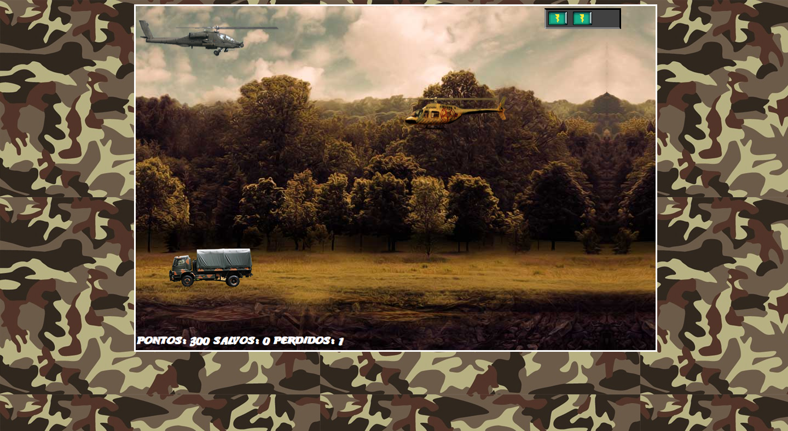

# Helicopter Rescue Game

This is a 2D game developed using HTML, CSS, JavaScript, and JQuery. In this game, an ally helicopter needs to rescue a man while some trucks are coming to kill him and enemy helicopters try to shoot us. The goal of this project is to provide a fun and interactive gaming experience to the user, while also showcasing front-end development skills.

## Installation

1. Clone the repository: `git clone https://github.com/Burntroll/Helicopter-Rescue-Game.git`
2. Navigate to the project directory: `cd Helicopter-Rescue-Game`
3. Open the index.html file in your preferred browser.

Alternatively, you can play the game online by visiting the following link: <I going to host on a website soon>

## Usage

This game was created for entertainment and fun purposes only. The objective of the game is to rescue the man by avoiding the trucks and enemy helicopters. The player can control the ally helicopter using **WSD** keys.

## Technologies Used

- HTML
- CSS
- JavaScript
- JQuery

## Acknowledgements

- This game was inspired by other rescue games.

## License

This project is licensed under the [MIT License](https://opensource.org/licenses/MIT).

## Results

